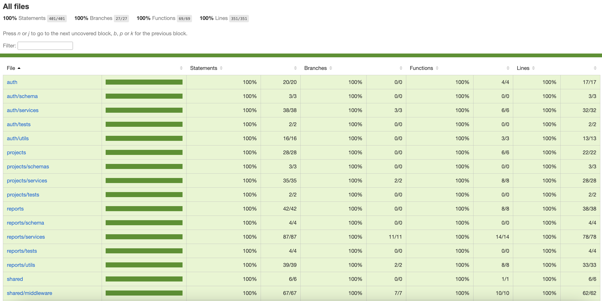

<p align="center">
  <a href="https://expressjs.com/" target="__blank"></a>
</p>

# Projectify - Backend

# Technologies used


# Code structure

```
src/
  ├── module/
    ├── dto/
    ├── models/
    ├── routes/
    ├── schema/
    ├── services/
    ├── tests/
    ├── utils/
    module.controller.ts


```

# Results

## Deployed website

<a href= 'https://projectify-server-production.up.railway.app/' target="__blank">https://projectify-server-production.up.railway.app/</a>

## Tests

- Testing Results:

<p align="left">
  <a target="__blank"></a>
</p>

# Clone Project and run it locally

1. Make sure you got docker-desktop installed on your pc
2. Clone the Repository

```
https://github.com/dasanchez11/the-mdb.git
```

3. Create a **.env** that has the same parameters as the **.env.example** and add environment variables

```
PORT =
MONGO_DB_URL = mongodb://<USERNAME>:<PASSWORD>@cluster0-shard-00-00.4ansb.mongodb.net:27017,cluster0-shard-00-01.4ansb.mongodb.net:27017,cluster0-shard-00-02.4ansb.mongodb.net:27017/<COLLECTION>?ssl=true&replicaSet=atlas-axqkna-shard-0&authSource=admin&retryWrites=true
SECRET_KEY =
```

4. Run the app on Docker

```
docker-compose up -d
```

5. Open the app on your web browser

```
http://localhost:3002/
```

6. Enjoy
